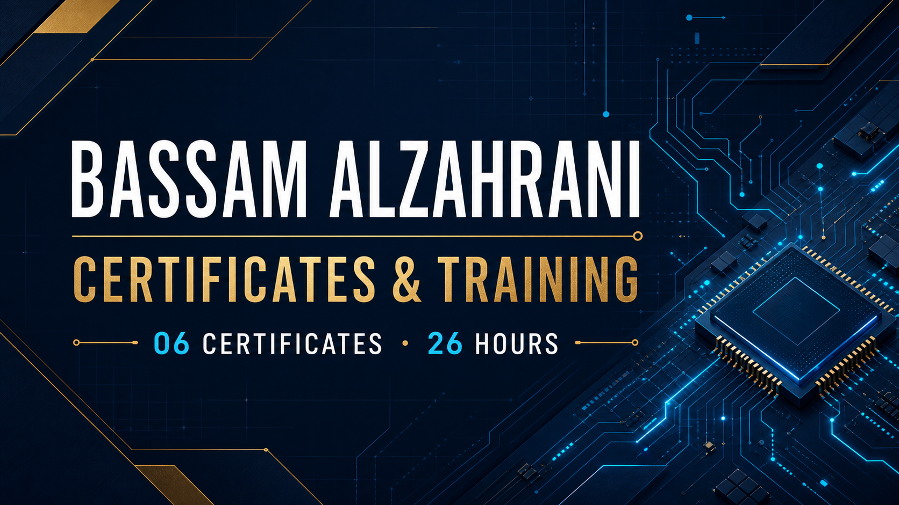
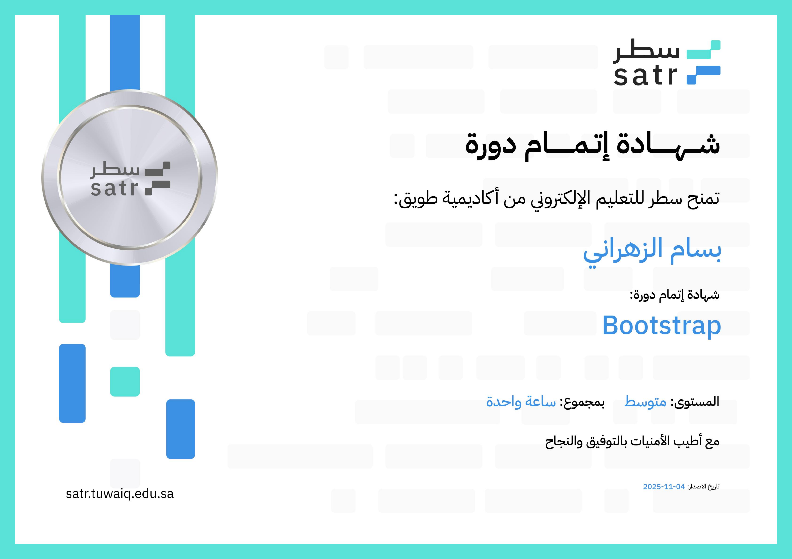
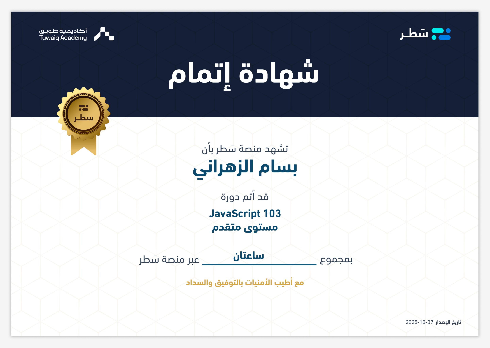
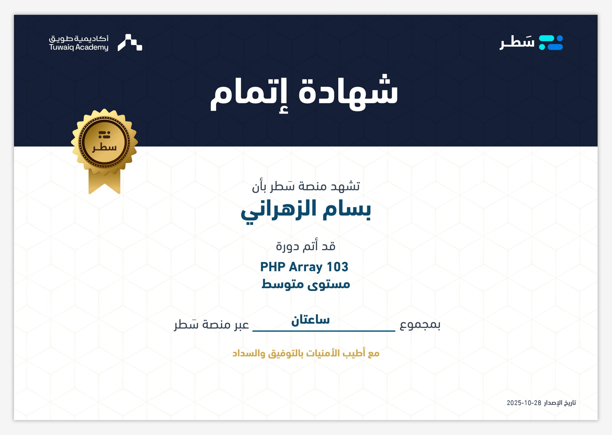
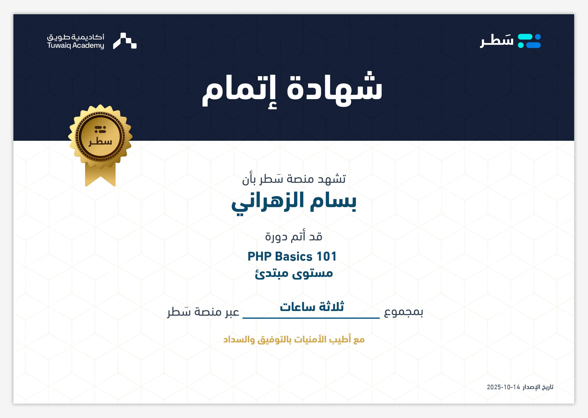
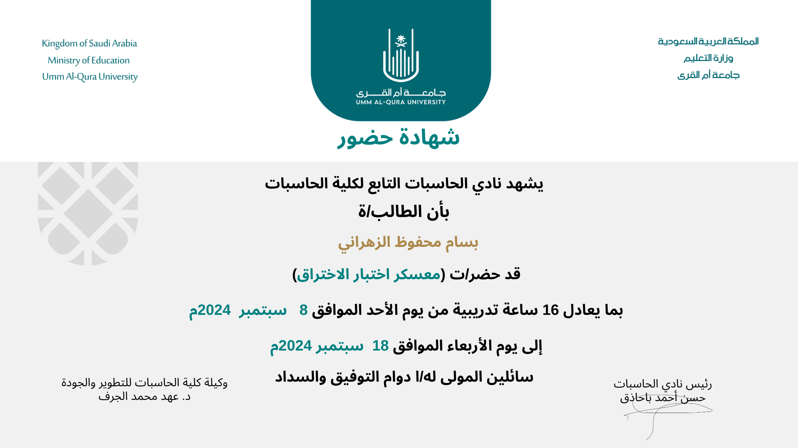

# Certificates & Training

  

**طالب علوم حاسب مهتم بالأمن السيبراني.**

**Computer Science student interested in cybersecurity.**

## Summary | الملخص

- **6** learning records
- **26** training hours
- **2** educational providers
- Web development and cybersecurity

## Course Completion | إتمام الدورات

### Bootstrap

- Provider: Satr Platform · Tuwaiq Academy
- Level: Intermediate
- Duration: 1 hour
- Issued: 04 November 2025
- [View certificate](public/certificates/satr/bootstrap.pdf)

### JavaScript 103

- Provider: Satr Platform · Tuwaiq Academy
- Level: Advanced
- Duration: 2 hours
- Issued: 07 October 2025
- [View certificate](public/certificates/satr/javascript-103.pdf)

### PHP Array 103

- Provider: Satr Platform · Tuwaiq Academy
- Level: Intermediate
- Duration: 2 hours
- Issued: 28 October 2025
- [View certificate](public/certificates/satr/php-array-103.pdf)

### PHP Basics 101

- Provider: Satr Platform · Tuwaiq Academy
- Level: Beginner
- Duration: 3 hours
- Issued: 14 October 2025
- [View certificate](public/certificates/satr/php-basics-101.pdf)

### PHP Functions 102

- Provider: Satr Platform · Tuwaiq Academy
- Level: Beginner
- Duration: 2 hours
- Issued: 21 October 2025
- [View certificate](public/certificates/satr/php-functions-102.pdf)

## Bootcamps & Attendance | المعسكرات والحضور

### Penetration Testing Bootcamp | معسكر اختبار الاختراق

- Provider: Computer Club, College of Computing · Umm Al-Qura University
- Type: Attendance certificate
- Duration: 16 training hours
- Dates: 08–18 September 2024
- [View certificate](public/certificates/umm-al-qura/penetration-testing-bootcamp.png)

---

> These records are presented as course-completion or attendance certificates. They are not represented as independent professional licenses.
